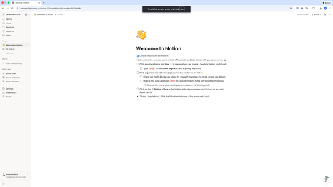
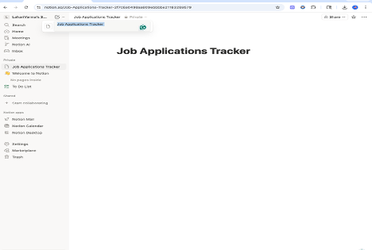
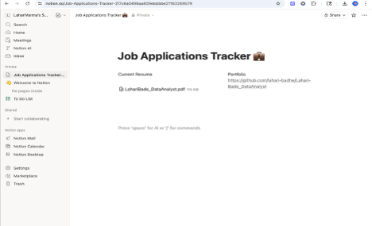
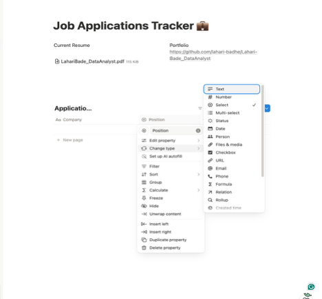
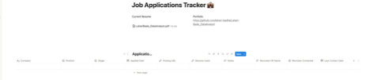
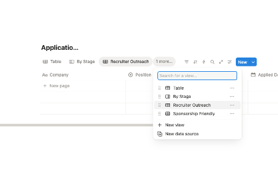
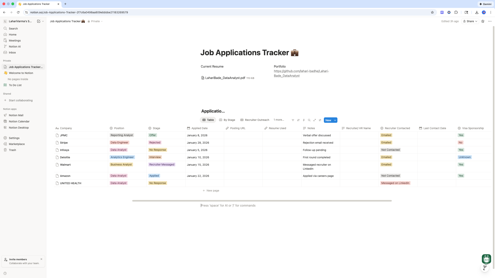

# Setup Guide – Job Applications Tracker

This document explains how to set up the Job Applications Tracker step by step using Notion.

The goal is to recreate the same tracking system used in this project without requiring any coding or local installation.

---

## Phase 1: Create a Notion Account

### Step 1: Sign up
1. Go to https://www.notion.so
2. Sign up using email or Google
3. Choose **Personal use**

---

## Phase 2: Create the Main Page

### Step 2: Create a new page
1. In the left sidebar, under **Private**, click **Add new**
2. Select **Empty page**

### Step 3: Name the page
Set the page title to: job-applications-tracker
---

## Phase 3: Add Resource Section (Optional)

This section is used to store quick access links.

### Step 4: Create a two-column layout
1. Click below the page title
2. Type `/column`
3. Choose **2 columns**

### Column setup
- **Column 1:** Resume  
  Upload your resume file (use a sample file if sharing publicly)

- **Column 2:** Portfolio  
  Paste your GitHub or portfolio link

---

## Phase 4: Create the Applications Database (Core System)

This is the main table used to track all job applications.

### Step 5: Create the table
1. Click below the columns so the page is full width
2. Type `/table`
3. Select **Table – Full page** or **Table – Inline**
4. Name the table:

---

## Phase 5: Configure Database Properties

Add or update the following columns in the table.

### Core fields
- **Company** – Text
- **Position** – Select  
  Options:
  - Data Analyst
  - Business Analyst
  - Analytics Engineer
  - Data Operations Analyst
  - Early Careers
  

- **Stage** – Select  
  Options:
  - Applied
  - Recruiter Messaged
  - Interview
  - Offer
  - Rejected
  - No Response
  

- **Applied Date** – Date
- **Posting URL** – URL
- **Resume Used** – Files & media
- **Notes** – Text

---

### Recruiter tracking fields
- **Recruiter / HR Name** – Text
- **Recruiter Contact** – Text or Email
- **Recruiter Contacted?** – Select  
  Options:
  - Yes
  - No

- **Last Contact Date** – Date

---
  

### Visa tracking field
- **Visa Sponsorship Available** – Select  
  Options:
  - Yes
  - No
  - Unknown

---

## Phase 6: Create Views

Views help organize and prioritize applications.

### View 1: By Stage (Kanban Board)
1. Click **+ Add a view** at the top of the table
2. Choose **Board**
3. Name the view: `By Stage`
4. Group by: **Stage**

---

### View 2: Recruiter Outreach
1. Click **+ Add a view**
2. Choose **Table**
3. Name the view: `Recruiter Outreach`
4. Add filter:
   - Recruiter Contacted? → is **Yes**

---

### View 3: Sponsorship Friendly
1. Click **+ Add a view**
2. Choose **Table**
3. Name the view: `Sponsorship Friendly`
4. Add filter:
   - Visa Sponsorship Available → is **Yes** or **Unknown**

---

## Phase 7: Using AI With This System

AI tools are used to support the workflow, not replace it.

Common usage:
- Summarize job descriptions and extract required skills
- Draft recruiter outreach or follow-up messages
- Compare resume keywords with job requirements

AI-generated content is reviewed manually before use.

---

## Screenshots

Screenshots included in this repository use **dummy data only**.
No real company names or personal information are shown.

## Sample Data (Demonstration Only)

To demonstrate real-world usage, sample job application entries were added to the tracker.
These entries help validate filters, views, and workflow behavior.

---

## Notes
This system is designed to be simple, reusable, and OPT-friendly.
Users can customize fields and views based on their personal job search needs.
